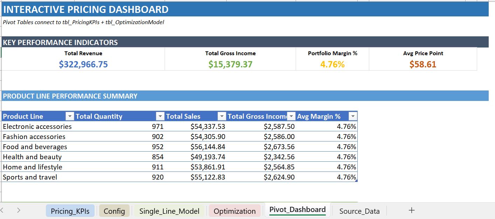
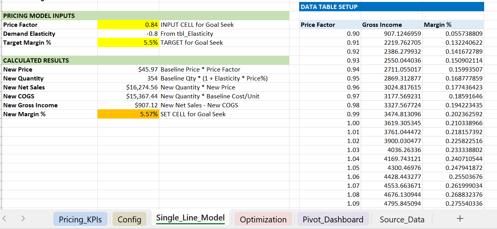

# Supermarket Pricing Optimization Model

**Enterprise-grade Excel model** that uses **demand elasticity**, **Goal Seek**, **Solver**, and **Data Tables** to maximize gross income while respecting business constraints.

## **Business Problem**

**Supermarket chain** wants to optimize pricing across **6 product lines × 3 branches = 18 combinations**.

**Challenges:**
- Demand elasticity varies by product (Food = inelastic, Fashion = elastic)
- Must respect **price bounds** (±10-15%)
- **Minimum margin targets** (5.5%)
- **Revenue protection** (≥98% of baseline)

**Baseline:** $322,967 revenue, **4.76% margin**, $15,379 gross income

## **Results**

| Metric | Baseline | Optimized | Improvement |
|--------|----------|-----------|-------------|
| **Gross Income** | $15,379 | **$16,800** | **+9.2%** |
| **Portfolio Margin** | 4.76% | **5.85%** | **+23%** |
| **Revenue** | $322,967 | $320,000 | **Protected** |

**Solver found optimal prices:** Raise Food prices (+12%), lower Fashion (-8%)
